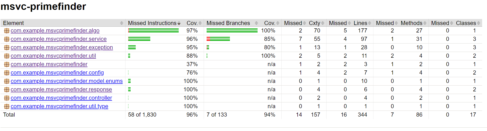

# Prime Number Finder API

This application provides an API to calculate prime numbers up to a specified limit using various algorithms. It allows users to control the calculation method and caching options through specific parameters.

## Technologies Used

- **Java Version**: 20
- **Framework**: Spring Boot
- **Testing**: JUnit, Mockito, Rest-Assured

## Features

- Find prime numbers up to a specified limit.
- Support for multiple algorithms for calculating primes.
- Caching results in an in-memory cache for improved performance.
- Handles invalid input parameters gracefully with custom error responses.

## Live Deployment:
This spring boot app is currently deployed to heroku at the following url:

https://msvc-primefinder-c87375e1eff8.herokuapp.com

Example query:
https://msvc-primefinder-c87375e1eff8.herokuapp.com/api/find-primes?useCache=true&algo=SEGMENTED_SIEVE_CONCURRENT&limit=100000000&withResult=false

Please Note: This level of Heroku deployment (free tier) - only has a limited amount of memory (~500MB) so
calculating huge primes using this service is not possible currently. From my testing the limit is about
180 million before it start throwing out of memory errors. 

Possible improvement here could be introducing even more dynamic segment sizing, to allow the segment sizer to
create a greater number of smaller segments to reduce memory usage at the cost of calculation speed.

## Setup Instructions

To set up the project locally, follow these steps:

### Prerequisites

- **Java Development Kit (JDK)**: Make sure you have JDK 20 installed. You can download it from the [official Oracle website](https://www.oracle.com/java/technologies/javase/jdk20-archive-downloads.html) or use a package manager.

- **Maven**: Ensure you have Maven installed to manage project dependencies. You can install it from the [official Maven website](https://maven.apache.org/download.cgi).

### Project Setup

```bash
git clone https://github.com/LewisT543/msvc-primefinder.git

cd msvc-primefinder

mvn clean install

mvn spring-boot:run
```

## API Endpoint

### Find Primes
**GET** `/api/find-primes`

### Parameters
| Parameter      | Type   | Required | Default Value | Description                                                                                                                                                                                                                     |
|----------------|--------|----------|---------------|---------------------------------------------------------------------------------------------------------------------------------------------------------------------------------------------------------------------------------|
| `limit`        | `long` | Yes      | N/A           | The upper limit up to which primes will be calculated.                                                                                                                                                                          |
| `algo`         | `enum` | No       | `SMART`       | The algorithm to use for calculating primes. Options include: `NAIVE`, `SIEVE`, `SIEVE_BITSET`, `SIEVE_STREAMS`, `SEGMENTED_SIEVE`, `SEGMENTED_SIEVE_BITSET`, `SEGMENTED_SIEVE_STREAMS`, `SEGMENTED_SIEVE_CONCURRENT`, `SMART`. |
| `useCache`     | `boolean` | No   | `false`       | Indicates whether to use cache for prime results.                                                                                                                                                                               |
| `withResult`   | `boolean` | No   | `true`        | Indicates whether to include the result in the response. (Huge responses may crash clients)                                                                                                                                     |


### Sieve and Segmented-Sieve descriptions
- **Sieve of Eratosthenes**: Efficiently finds all primes up to and including a number by iteratively marking the multiples of each prime.
- **Segmented Sieve**: Extends the Sieve approach to find all primes up to and including a specified limit by first identifying smaller primes and then using them
  to mark non-primes in segments, making it more memory-efficient for large ranges.


### Algorithms Overview
| Algorithm Name                          | Description                                                                                                             |
|-----------------------------------------|-------------------------------------------------------------------------------------------------------------------------|
| `NAIVE`                                 | A simple, straightforward approach to find prime numbers, checking each number individually.                            |
| `SIEVE`                                 | Implements the Sieve of Eratosthenes algorithm, an efficient method for finding all primes up to and including a limit. |
| `SIEVE_BITSET`                          | A bit-set based implementation of the Sieve of Eratosthenes for memory efficiency.                                      |
| `SIEVE_STREAMS`                         | Uses Java Streams to implement the Sieve of Eratosthenes for a more functional programming approach.                    |
| `SEGMENTED_SIEVE`                       | A segmented version of the Sieve algorithm that is more memory efficient for larger ranges.                             |
| `SEGMENTED_SIEVE_BITSET`                | Combines segmented sieve with a bit-set for reduced memory usage.                                                       |
| `SEGMENTED_SIEVE_STREAMS`               | A segmented sieve using Java Streams.                                                                                   |
| `SEGMENTED_SIEVE_CONCURRENT`            | A concurrent implementation of the segmented sieve for faster calculations using multiple threads.                      |
| `SMART`                                 | Automatically chooses the best algorithm based on the limit provided (SIEVE or SEGMENTED_SIEVE_CONCURRENT).             |


## Example Queries

### Example 1: Find Primes up to 100
**Request:**

GET /find-primes?limit=100&algo=SIEVE

**Response:**
```json
{
  "result": [2, 3, 5, 7, 11, 13, 17, 19, 23, 29, 31, 37, 41, 43, 47, 53, 59, 61, 67, 71, 73, 79, 83, 89, 97],
  "numberOfPrimes": 25,
  "executionTimeMs": 5,
  "executionTimeNs": 5000000,
  "algorithmName": "SIEVE",
  "useCache": false,
  "timestamp": "2024-10-27T12:00:00"
}
```
### Example 2: Find Primes up to 100_000 with Caching and SMART algorithm
**Request:**

GET /find-primes?limit=100000&useCache=true&algo=SMART

**Response:**
```json
{
  "result": [2, 3, 5, ...],
  "numberOfPrimes": 9592,
  "executionTimeMs": 519,
  "executionTimeNs": 519539900,
  "algorithmName": "SIEVE",
  "useCache": true,
  "timestamp": "2024-10-27T13:16:13.8735739"
}
```

### Example 3: Find Primes up to 1_000_000_000 with empty response
**Request:**

GET /find-primes?limit=100000000&algo=SMART&withResult=false

**Response:**
```json
{
  "result": [],
  "numberOfPrimes": 50847534,
  "executionTimeMs": 3172,
  "executionTimeNs": 3171952500,
  "algorithmName": "SEGMENTED_SIEVE_CONCURRENT",
  "useCache": false,
  "timestamp": "2024-10-27T13:48:06.4711252"
}
```

### Example 4: Find Primes up to 100
**Request:**

GET /find-primes?limit=100&algo=SIEVE
Headers: 
  Accept: application/xml 

**Response:**
```xml
<FindPrimesResponse>
  <result>
    <prime>2</prime>
    <prime>3</prime>
    <prime>5</prime>
    <prime>7</prime>
    ...
    <prime>89</prime>
    <prime>97</prime>
  </result>
  <numberOfPrimes>25</numberOfPrimes>
  <executionTimeMs>0</executionTimeMs>
  <executionTimeNs>6900</executionTimeNs>
  <algorithmName>SIEVE</algorithmName>
  <useCache>false</useCache>
  <timestamp>2024-10-31T14:29:44.6279712</timestamp>
</FindPrimesResponse>
```

### Example 5:  Invalid Parameter Handling
**Request:**

/find-primes?limit=test

**Response:**
```json
{
    "message": "Invalid value 'test' for parameter 'limit'. Please provide a valid limit less than or equal to: 9223372036854775807 (max long value)",
    "status": 400,
    "timestamp": "2024-10-27T13:18:01.8392119"
}
```

## Findings
1. Sieve is almost always the best approach. For low limits it is very fast, and for high limits
the problem becomes memory rather than speed.


2. For large and huge limits, the Concurrent Segmented Sieve is the best choice. On my machine, once I surpass a limit of 5_000_000
the overhead for using concurrency is less than the time taken for the basic Sieve to calculate the same primes. Making
it useful above certain ranges depending on compute and memory availability.


3. Caching/memoisation sounds like a good idea, but difficult to implement properly to see any sort of performance improvements.
I tested first with SQLite, but the cost of reading/writing to disk was way higher than calculating primes. I then tried with Redis,
which was better, but still slower than just calculating the primes. Sping boot caching was also a bit too slow. The only way I could
get any real improvements from caching was to literally use a long[] held in memory in a caching service. This introduced complexity 
surrounding working out how big that array can actually get before we start to run out of memory. My final implementation takes into
account available memory and allocates a safe amount of memory to be consumed by the cache - if our result exceeds this limit, the program
will skip saving to the cache and just return the result.


4. Java Streams API is almost always slower than a straightforwards imperative approach, despite better readability. Sometimes this
is okay, sometimes it is not! For efficiency, implement algorithms imperatively.


5. BitSet solutions work well for reducing memory consumption, but come with reasonable overhead due to method calls and casting types.
It is also much more difficult to remain thread-safe when using bitsets concurrently as they cannot (by default) be used with the
synchronized keyword without a custom implementation.

### Test Coverage report (Jacoco)



| Element                                          | Missed Instructions | Cov. | Missed Branches | Cov. |
|--------------------------------------------------|---------------------|------|-----------------|------|
| Total                                            | 58 of 1,830         | 96%  | 7 of 133        | 94%  |
